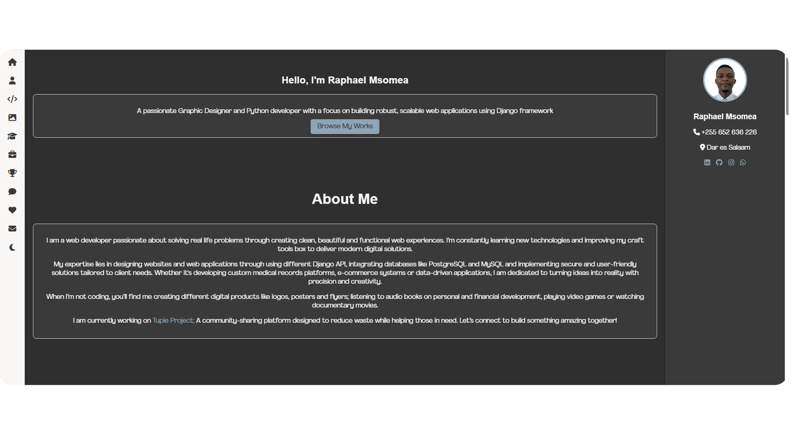
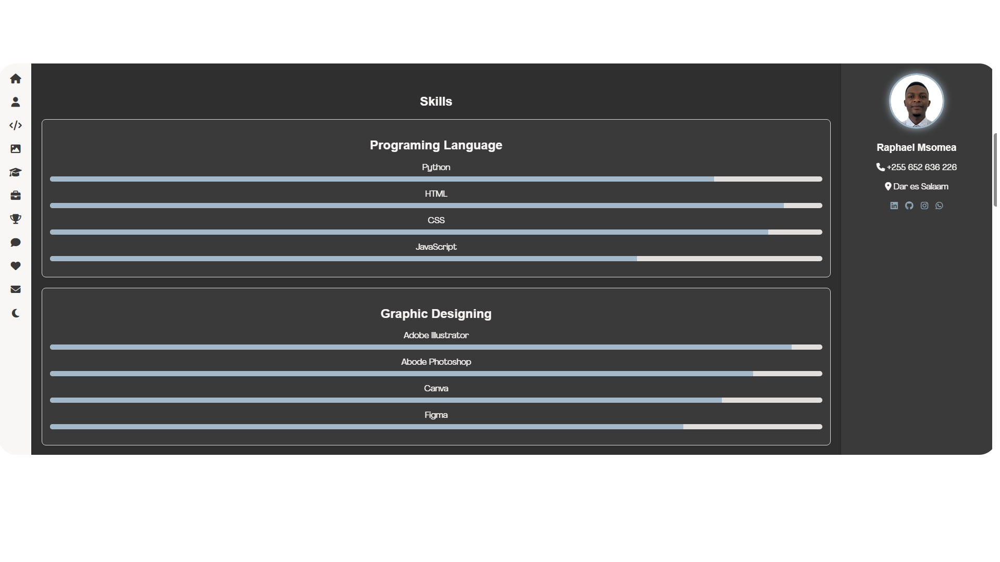
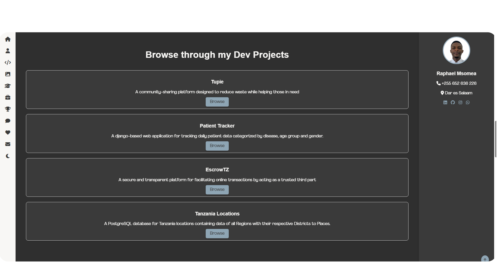
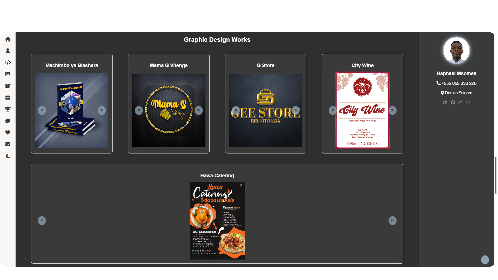
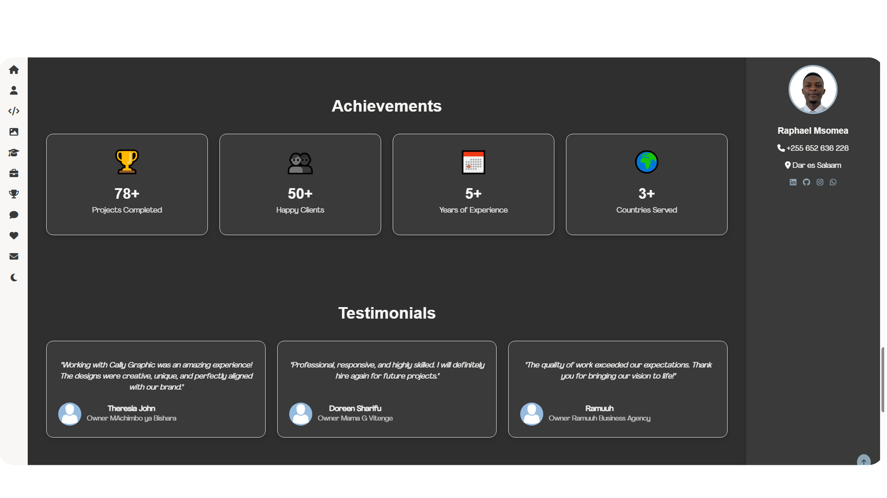
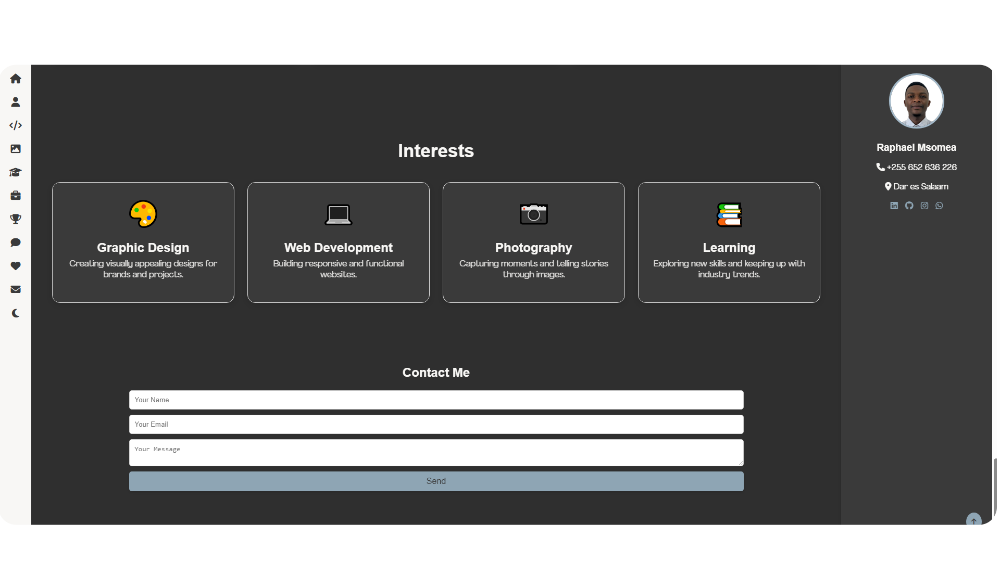

Hello. I am **Raphael Msomea** A passionate **Graphic Designer** and **Python Developer** with a focus on building robust, scalable web applications using Django framework.
- [Visit my Portfolio page](https://msomea.github.io/msomea/)

## About me
- I am a web developer passionate about solving real life problems through creating clean, beautiful and functional web experiences. I’m constantly learning new technologies and improving my craft tools box to deliver modern digital solutions.

- My expertise lies in designing websites and web applications through using different Django API, integrating databases like PostgreSQL and MySQL and implementing secure and user-friendly solutions tailored to client needs. Whether it's developing custom medical records platforms, e-commerce systems or data-driven applications, I am dedicated to turning ideas into reality with precision and creativity.
**[View my Portfolio Here](https://msomea.github.io/msomea/)**

## Screenshots
| Hero Section | Skills Section |
|--------------|---------------|
|  |  |

| Dev Pojects Section   | Graphic Project |
|------------------|-------------------|
|  |  |

| Achievements and Testimonials Section | Interest Section |
|------------------|-------------------|
|  |  |

## Contact
- **Name:** Raphael Msomea
- **Email:** msomearaphael@gmail.com
- **WhatsApp** [Lets connect](https://wa.me/255652636226?text=Hello%20CallyGRAPHIC)
- **Instagram** [View my page](https://www.instagram.com/callygraphic_tz)
- **Linkedin** [Let linked on](https://www.linkedin.com/in/msomea)
- **Portfolio:** [Visit my page](https://msomea.github.io/msomea/)

